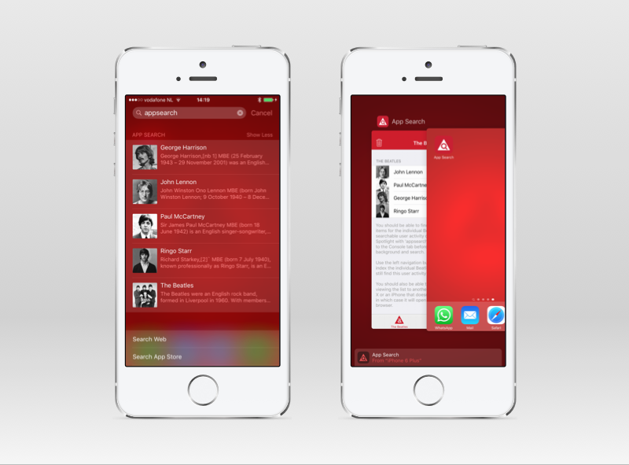
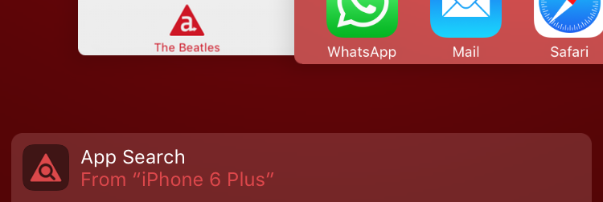

# iOS App Search Sample App

This sample app demonstrates how to make your app searchable by using new API's introduced in iOS 9 and supported by Titanium 5.0.0.

## The big picture
I highly recommend reading through all of our new [Spotlight Search Guide](http://docs.appcelerator.com/platform/latest/#!/guide/Spotlight_Search) as well as Apple's [App Search Programming Guide](https://developer.apple.com/library/prerelease/ios/documentation/General/Conceptual/AppSearch/index.html) and related documentation but here's the gist of it:

* Use [NSUserActivity](https://developer.apple.com/library/prerelease/ios/documentation/Foundation/Reference/NSUserActivity_Class/index.html) to [index activities and navigation points](https://developer.apple.com/library/prerelease/ios/documentation/General/Conceptual/AppSearch/Activities.html) on-device and make them available for Spotlight search results and [Handoff](https://developer.apple.com/library/prerelease/ios/documentation/UserExperience/Conceptual/Handoff/HandoffFundamentals/HandoffFundamentals.html) - even [from app to web browser and visa versa](https://developer.apple.com/library/prerelease/ios/documentation/UserExperience/Conceptual/Handoff/AdoptingHandoff/AdoptingHandoff.html#//apple_ref/doc/uid/TP40014338-CH2-SW21).
* Use the [Core Spotlight Framework](https://developer.apple.com/library/prerelease/ios/documentation/CoreSpotlight/Reference/CoreSpotlight_Framework/index.html) to [index app content](https://developer.apple.com/library/prerelease/ios/documentation/General/Conceptual/AppSearch/AppContent.html) on-device and make it available via Spotlight search results.
* Use [Mark Up](https://developer.apple.com/library/prerelease/ios/documentation/General/Conceptual/AppSearch/WebContent.html) to index website content and make it available for all iOS users in Spotlight and Safari search results.
* Use [Universal Links](https://developer.apple.com/library/prerelease/ios/documentation/General/Conceptual/AppSearch/UniversalLinks.html) and [Smart App Banners](https://developer.apple.com/library/prerelease/ios/documentation/AppleApplications/Reference/SafariWebContent/PromotingAppswithAppBanners/PromotingAppswithAppBanners.html) to enable users to open your app with the same content they were viewing on your website.
* [Combine](https://developer.apple.com/library/prerelease/ios/documentation/General/Conceptual/AppSearch/CombiningAPIs.html) NSUserActivity, Core Spotlight and Markup for the same content by using the same identifiers and webpageURL.

As you can see Apple wants users to seamlessly move between apps (via search), devices (via handoff) as well as between native apps and websites (via handoff, search and universal links). Apple's programming guide has a nice list of [example implementations](https://developer.apple.com/library/prerelease/ios/documentation/General/Conceptual/AppSearch/Choosing.html) for different types of apps to give an idea of what this might work for your app.

## Spotlight

The Spotlight tab in the sample app shows you a list of the four Beatles. I use a [undefined model](app/models/array.js) which means I have to [populate (reset) the collection](app/controllers/spotlight.js#L24) every time the app opens. Ideal if you want to use Alloy's data-binding for any array of objects.

### Indexing items
Scroll down to [line 60-120](app/controllers/spotlight.js#L60) of `app/controllers/spotlight.js` to see how I add the Beatles to the Spotlight index. There are three parts to it:

* [Ti.App.iOS.SearchableItemAttributeSet](http://docs.appcelerator.com/platform/latest/#!/api/Titanium.App.iOS.SearchableItemAttributeSet) to create meta data for..
* [Ti.App.iOS.SearchableItem](http://docs.appcelerator.com/platform/latest/#!/api/Titanium.App.iOS.SearchableItem) which is the actual item to add to an instance of..
* [Ti.App.iOS.SearchableIndex](http://docs.appcelerator.com/platform/latest/#!/api/Titanium.App.iOS.SearchableIndex)

The attribute set has a [huge amount of properties](https://developer.apple.com/library/prerelease/ios/documentation/CoreSpotlight/Reference/CSSearchableItemAttributeSet_Class/index.html#//apple_ref/doc/uid/TP40016247-CH1-DontLinkElementID_170) you can use to describe the item. Some let iOS play a song, call a phone number or navigate to an address directly from the results without even opening your app. You'll notice that in the sample I've used an URL as `uniqueIdentifier`. I will explain why when we come to *User Activities*.

In short, this is how you'd index a single item:

	var index = Ti.App.iOS.createSearchableIndex();
	
	index.addToDefaultSearchableIndex([
	
		Ti.App.iOS.createSearchableItem({
			uniqueIdentifier: 'myIdOrUrl',
			domainIdentifier: 'content.type',
			attributeSet: Ti.App.iOS.createSearchableItemAttributeSet({
				title: 'My Item'
			})
		})
	
	], function (e) {
		e.success || alert('Oops!');
	});

### Deleting items
Indexed items expire automatically after one month, unless you have set [Ti.App.iOS.SearchableItem.expirationDate](http://docs.appcelerator.com/platform/latest/#!/api/Titanium.App.iOS.SearchableItem-property-expirationDate). You can also manually delete all, items with a specific domain or specific items via the SearchableIndex's `delete*` methods.

The Spotlight list in the sample app has a Trash/Add icon as the right navigation bar button to [delete all items](app/controllers/spotlight.js#L24) for the Beatles domain or re-index the items. Search for `appsearch` before and after deleting items to see it is effective immediately.

	var index = Ti.App.iOS.createSearchableIndex();
	
	index.deleteAllSearchableItemByDomainIdenifiers(['content.type'],
		function (e) {
			e.success || alert('Oops!');
		}
	);

### Handling a search result
When a user taps on a Spotlight search result your app is opened and will receive the [continueactivity](http://docs.appcelerator.com/platform/latest/#!/api/Titanium.App.iOS-event-continueactivity) event. Be aware that this event is also fired when a User Activity is handed off to your device.

In the case of a Spotlight search result the event's `activityType` property will be `com.apple.corespotlightitem` and `searchableItemActivityIdentifier` will have the `uniqueIdentifier` you've set on the indexed item.

Lines [145-175](app/controllers/spotlight.js#L145) in `spotlight.js` show how you can use this information to navigate your app to the content the user selected. In our case we share an [openDetail()](app/controllers/spotlight.js#L180) helper function with the ListView's `itemclick` listener to look up the model and open a detail window with more information.

	Ti.App.iOS.addEventListener('continueactivity', function(e) {
		
		// Not for us
		if (e.activityType !== 'com.apple.corespotlightitem') {
			return
		}
		
		var uniqueIdentifier = e.searchableItemActivityIdentifier;
			
		// Navigate to the content
	});

## User activities

The [NSUserActivity](https://developer.apple.com/library/prerelease/ios/documentation/Foundation/Reference/NSUserActivity_Class/index.html#//apple_ref/occ/cl/NSUserActivity) class introduced in iOS 8 to enable [Handoff](https://developer.apple.com/library/prerelease/ios/documentation/UserExperience/Conceptual/Handoff/HandoffFundamentals/HandoffFundamentals.html) can now also save its state to the on-device and/or public search index. The new [Ti.App.iOS.UserActivity](http://docs.appcelerator.com/platform/latest/#!/api/Titanium.App.iOS.UserActivity) API in Titanium 5.0 gives you access to all these features.

### Spotlight vs UserActivity
There's a very subtle difference between indexing for on-device search using Core Spotlight and User Activities. Think of indexing User Actives as tracking the pages users *have* visited, where Core Spotlight allows you to index the actual content that might be on one or more of these pages.

### Public index
Only if you set `eligibleForPublicIndexing:true` as well as the required `requiredUserInfoKeys` or `webpageURL` properties will the user activity be eligible for public indexing. *Eligible*... which means that it will only surface if you [combine the APIs](https://developer.apple.com/library/prerelease/ios/documentation/General/Conceptual/AppSearch/CombiningAPIs.html#//apple_ref/doc/uid/TP40016308-CH10-SW1) and have a web version for the same content/activity. Remember *Spotlight vs UserActivity*? Indexing user activities counts as pageviews for the related content and as such is one of the ways to [Enhance Your Search Results](https://developer.apple.com/library/prerelease/ios/documentation/General/Conceptual/AppSearch/SearchUserExperience.html#//apple_ref/doc/uid/TP40016308-CH11-SW1).

### Back to the Beatles
Open [app/controllers/detail.js](app/controllers/detail.js) to see how we create and call `becomeCurrent()` on the user activity of reading up on one of the Beatles in the detail window.

As you can see use `Ti.App.iOS.SearchableItemAttributeSet` again to describe the activity. This time we also set its `relatedUniqueIdentifier` property to the same value of the Spotlight item's `uniqueIdentifier`. This will make Apple aware this activity should be counted as a *pageview* to the linked content and allow it to send users that already have it installed straight from Safari search results to the app.

Install the sample app on two iOS 8+ devices to test handing off the activity of viewing a *Beatle* between devices. In iOS 9 simply double-tap the home button and it should appear along the bottom edge of the screen:

### Updating an activity's state for Handoff
Our sample app has another *UserActivity* tab to demonstrate another feature related to Handoff. While viewing information on one of the Beatles is as static as it gets, handoff is often used for activities that do change, like starting an email on your iPhone and continue it on your iPad.

At first sight the [useractivity.js](app/controllers/useractivity.js) controller is very similar to [detail.js](app/controllers/detail.js). Notice that time we did not use a *SearchableItemAttributeSet* to describe our activity but used the [subset of descriptors](http://docs.appcelerator.com/platform/latest/#!/api/Titanium.App.iOS.UserActivity-property-keywords) available directly via the UserActivity object. Search for *appsearch* in Spotlight and you should still find the activity but with no description or custom image this time.

Every time you make a change to the message in the TextArea, [we set](app/controllers/useractivity.js#L166) the activity's `needsSave` property to `true` to tell iOS we want to be able to update the activity state before it might be handed off to another device. For this, we've added a listener to the activity's `useractivitywillsave` event which you can find near [line #120](app/controllers/useractivity.js#L120). Here we simply update the `userInfo` property.

> **NOTE:** Just like `Ti.UI.View.font` you need to set the full `userInfo` object.

Just like we did for the Beatles we receive the handoff on the other by listening to the `continueactivity` event on [lines 18-42](app/controllers/useractivity.js#L18). Finally, the activity on the first device will receive the `useractivitywascontinued` event. This where you'd inform the user or maybe even lock the view to prevent further changes ([lines 140-146](app/controllers/useractivity.js#L140)).

They say a picture says more then 1000 lines of code:

Give it a try! Install the sample app on two iOS 8+ devices, change the message on the first one, then double tap home or lock the other to request a handoff and continue the message there.

## Web Markup & Universal Links
Since our sample is not in the App Store I cannot demonstrate [how to combine](https://developer.apple.com/library/prerelease/ios/documentation/General/Conceptual/AppSearch/CombiningAPIs.html#//apple_ref/doc/uid/TP40016308-CH10-SW1) the UserActivity and Spotlight APIs with Web Markup and Universal Links. Fortunately, Apple has a [excellent guide](https://developer.apple.com/library/prerelease/ios/documentation/General/Conceptual/AppSearch/WebContent.html) on this topic. As discussed, our sample *does* show how to link a User Activity with a Spotlight item using `relatedUniqueIdentifier` and how to link both to a web activity using `webpageURL`. The rest... is up to you!

When you're done, use the [App Search API Validation Tool](https://search.developer.apple.com/appsearch-validation-tool).

## Links

* [Appcelerator Spotlight Search Guide](http://docs.appcelerator.com/platform/latest/#!/guide/Spotlight_Search)
* [Appcelerator Handoff User Activities Guide](http://docs.appcelerator.com/platform/latest/#!/guide/Handoff_User_Activities)
* [Apple Handoff Programming Guide](https://developer.apple.com/library/prerelease/ios/documentation/UserExperience/Conceptual/Handoff/HandoffFundamentals/HandoffFundamentals.html)
* [Apple App Search Programming Guide](https://developer.apple.com/library/prerelease/ios/documentation/General/Conceptual/AppSearch/index.html)
